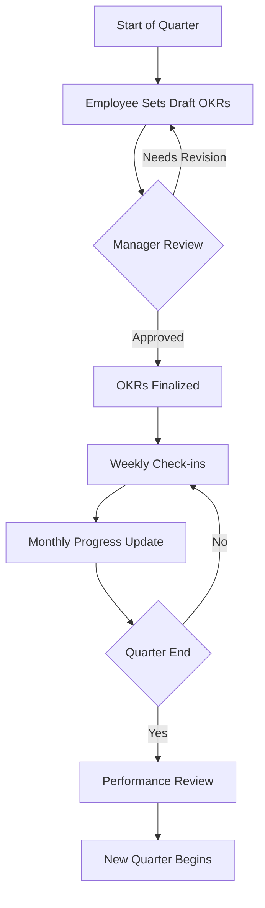
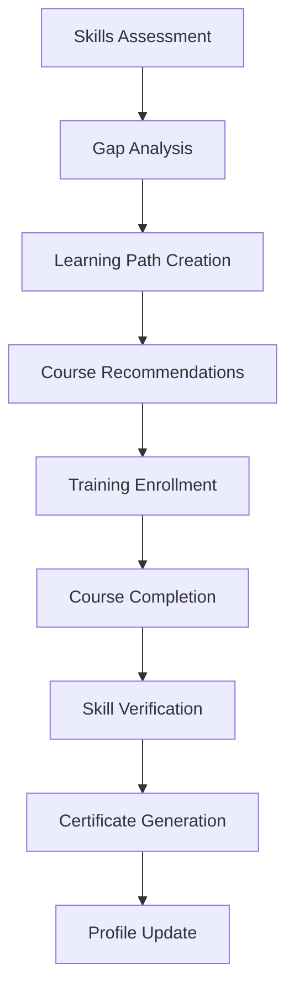
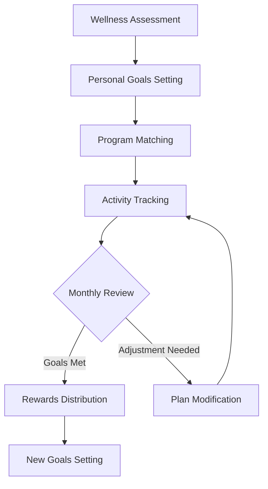
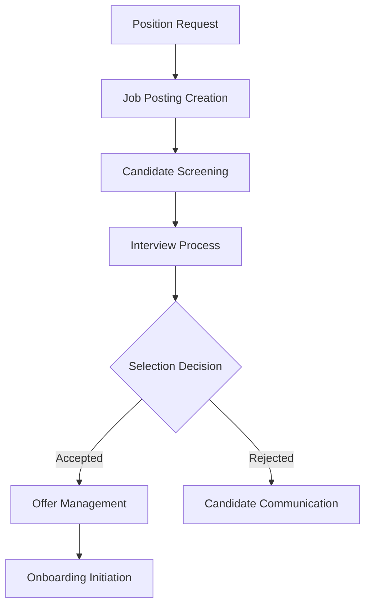
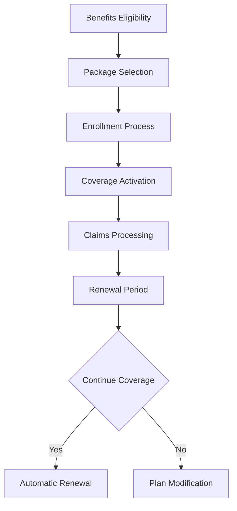
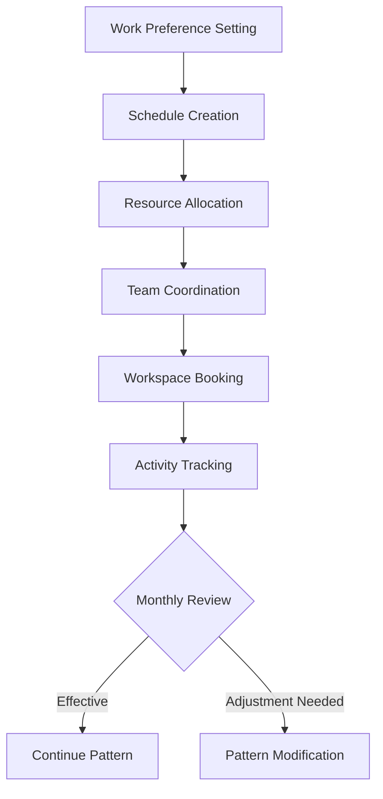

# HR Feature Workflows & User Journeys

## 1. Performance Management Journey

### 1.1 Goal Setting & OKR Workflow

### 1.2 User Touchpoints
1. Initial Setup Phase
   - System notification for OKR setting
   - Access to OKR templates
   - Previous quarter performance data
   - Team alignment view

2. Progress Tracking Phase
   - Weekly reminder notifications
   - Progress update forms
   - Peer feedback collection
   - Achievement documentation

3. Review Phase
   - Self-assessment form
   - Manager evaluation interface
   - Performance dashboard
   - Development planning tools

## 2. Learning & Development Journey

### 2.1 Skill Development Workflow

### 2.2 User Touchpoints
1. Assessment Phase
   - Skills survey interface
   - Competency frameworks
   - Role requirements mapping
   - Current skill level indicators

2. Learning Phase
   - Course catalog access
   - Progress tracking dashboard
   - Learning schedule planner
   - Resource library

3. Verification Phase
   - Assessment modules
   - Practical application tasks
   - Peer review system
   - Certification process

## 3. Employee Wellbeing Journey

### 3.1 Wellness Program Workflow

### 3.2 User Touchpoints
1. Initial Assessment
   - Health survey interface
   - Goal setting tools
   - Program recommendations
   - Resource library access

2. Active Participation
   - Activity logging interface
   - Progress visualization
   - Challenge participation
   - Community engagement

3. Review & Rewards
   - Achievement tracking
   - Rewards catalog
   - Program modification tools
   - Success celebration

## 4. Recruitment & Onboarding Journey

### 4.1 Hiring Workflow

### 4.2 User Touchpoints
1. Requisition Phase
   - Position request form
   - Approval workflow
   - Budget verification
   - Job description builder

2. Selection Phase
   - Candidate evaluation forms
   - Interview scheduling
   - Assessment tracking
   - Communication templates

3. Onboarding Phase
   - Documentation checklist
   - Training schedule
   - Resource access
   - Progress tracking

## 5. Benefits & Rewards Journey

### 5.1 Benefits Management Workflow

### 5.2 User Touchpoints
1. Selection Phase
   - Benefits calculator
   - Package comparison tools
   - Cost estimators
   - Dependent information management

2. Management Phase
   - Claims submission interface
   - Coverage verification
   - Provider network access
   - Document repository

3. Review Phase
   - Usage analysis
   - Cost-benefit review
   - Modification options
   - Renewal decisions

## 6. Hybrid Work Management Journey

### 6.1 Flexible Work Workflow

### 6.2 User Touchpoints
1. Setup Phase
   - Preference selection interface
   - Schedule planner
   - Team calendar integration
   - Resource request system

2. Operation Phase
   - Workspace booking system
   - Equipment tracking
   - Collaboration tools
   - Performance metrics

3. Optimization Phase
   - Pattern analysis
   - Effectiveness metrics
   - Adjustment tools
   - Team feedback system

## Implementation Guidelines

### Success Metrics
1. User Engagement
   - Platform adoption rate
   - Feature utilization
   - User satisfaction scores
   - Support ticket volume

2. Process Efficiency
   - Time-to-completion
   - Error reduction
   - Automation success
   - Resource optimization

3. Business Impact
   - Cost savings
   - Productivity gains
   - Employee satisfaction
   - Retention improvement

### Continuous Improvement
1. Feedback Collection
   - User surveys
   - Usage analytics
   - Performance metrics
   - Support tickets

2. Optimization Steps
   - Regular review cycles
   - Feature updates
   - Process refinement
   - User experience enhancement