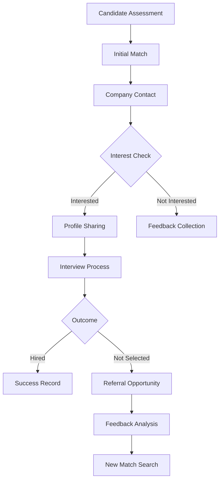
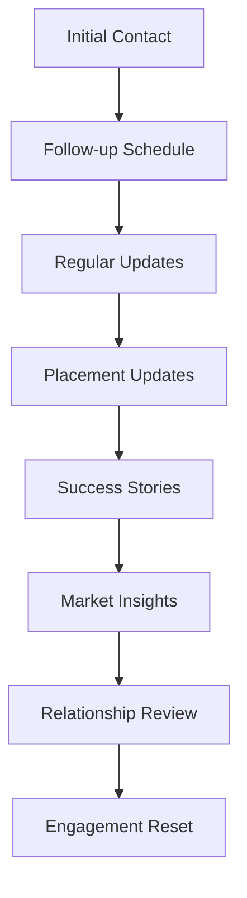

# Business Contact Registry & Referral System

## 1. Contact Database Structure

### 1.1 Employer Segment
```json
{
    "company_profile": {
        "company_id": "unique_identifier",
        "company_name": "string",
        "industry": "string",
        "size_range": "enum",
        "locations": ["array"],
        "hiring_frequency": "enum",
        "preferred_contact_method": "enum",
        "recruitment_cycles": ["array"],
        "active_status": "boolean"
    },
    "contact_persons": [{
        "contact_id": "unique_identifier",
        "name": "string",
        "position": "string",
        "department": "string",
        "email": "string",
        "phone": "string",
        "preferred_contact_time": "string",
        "last_contact_date": "date",
        "relationship_strength": "integer",
        "notes": "string"
    }],
    "hiring_preferences": {
        "skill_requirements": ["array"],
        "experience_levels": ["array"],
        "culture_attributes": ["array"],
        "compensation_range": "object",
        "benefits_offered": ["array"]
    }
}
```

### 1.2 Candidate Segment
```json
{
    "candidate_profile": {
        "candidate_id": "unique_identifier",
        "name": "string",
        "professional_summary": "string",
        "current_status": "enum",
        "availability": "date",
        "preferred_locations": ["array"],
        "salary_expectations": "object",
        "notice_period": "string"
    },
    "skills_matrix": {
        "technical_skills": ["array"],
        "soft_skills": ["array"],
        "certifications": ["array"],
        "languages": ["array"]
    },
    "referral_history": [{
        "referral_id": "unique_identifier",
        "company": "string",
        "position": "string",
        "referral_date": "date",
        "status": "enum",
        "feedback": "string",
        "strength_indicators": ["array"]
    }]
}
```

## 2. Referral Workflow System

### 2.1 Referral Process Flow


### 2.2 Feedback Collection Form
```
CANDIDATE FEEDBACK FORM

Candidate ID: [Auto-populated]
Position: [Text Field]
Company: [Auto-populated]

ASSESSMENT AREAS (Rate 1-5):
□ Technical Skills: ___
□ Soft Skills: ___
□ Culture Fit: ___
□ Experience Level: ___

DETAILED FEEDBACK:
Strengths: [Text Area]
Areas for Development: [Text Area]
Role Mismatch Factors: [Text Area]

REFERRAL POTENTIAL:
□ Recommended for similar roles
□ Recommended for different roles
□ Not recommended at this time

Suggested Role Types: [Multi-select]
Suggested Industry Sectors: [Multi-select]

Additional Notes: [Text Area]
```

## 3. Contact Engagement System

### 3.1 Employer Engagement Tracker
- Contact Frequency
- Response Rates
- Placement Success
- Feedback Quality
- Referral Generation
- Relationship Strength

### 3.2 Communication Templates

#### 3.2.1 Initial Contact Template
```
Subject: Exceptional [Role] Candidate - Perfect for [Company]

Dear [Contact Name],

I trust this finds you well. Based on our understanding of [Company]'s hiring needs for [Role], I'd like to introduce a candidate who perfectly matches your requirements:

Key Highlights:
- [Specific Skill Match]
- [Relevant Experience]
- [Cultural Fit Indicator]

Would you be interested in reviewing their profile?

Best regards,
[Recruiter Name]
```

#### 3.2.2 Referral Request Template
```
Subject: Candidate Referral Opportunity - [Skill Area]

Dear [Contact Name],

While [Candidate] wasn't the perfect fit for [Original Position], their strengths in [Areas] could be valuable for other opportunities.

Standout Qualities:
- [Quality 1]
- [Quality 2]
- [Quality 3]

Would you know of any companies seeking these skills?

Best regards,
[Recruiter Name]
```

## 4. Analytics & Reporting

### 4.1 Contact Performance Metrics
- Contact Response Rate
- Placement Success Rate
- Referral Generation Rate
- Feedback Quality Score
- Relationship Strength Index
- Engagement Frequency

### 4.2 Referral Success Metrics
- Referral to Placement Ratio
- Time to Placement
- Referral Chain Length
- Feedback Utilization Rate
- Candidate Success Rate
- Industry Match Rate

## 5. Contact Nurturing System

### 5.1 Engagement Calendar


### 5.2 Value Addition Touchpoints
1. Industry Insights Sharing
2. Market Trends Reports
3. Talent Pool Updates
4. Success Story Sharing
5. Networking Opportunities
6. Resource Sharing

## 6. Implementation Guidelines

### 6.1 Contact Quality Scoring
```
CONTACT SCORING MATRIX

Engagement Level (40%):
- Response Rate: 15%
- Meeting Attendance: 10%
- Feedback Quality: 15%

Placement Success (30%):
- Direct Placements: 15%
- Referral Success: 15%

Relationship Value (30%):
- Industry Influence: 10%
- Network Reach: 10%
- Information Share: 10%
```

### 6.2 Relationship Development Stages

1. Initial Contact Phase
   - Introduction
   - Need Assessment
   - Value Proposition
   - Response Tracking

2. Development Phase
   - Regular Engagement
   - Value Addition
   - Trust Building
   - Feedback Collection

3. Partnership Phase
   - Strategic Alignment
   - Proactive Sharing
   - Mutual Benefits
   - Long-term Planning

## 7. Best Practices

### 7.1 Contact Management
- Regular Data Verification
- Engagement History Tracking
- Preference Updates
- Communication Logging
- Relationship Scoring

### 7.2 Referral Management
- Feedback Collection
- Match Quality Tracking
- Success Monitoring
- Chain Tracking
- Value Assessment

### 7.3 Data Protection
- Privacy Compliance
- Consent Management
- Data Security
- Access Control
- Audit Trail