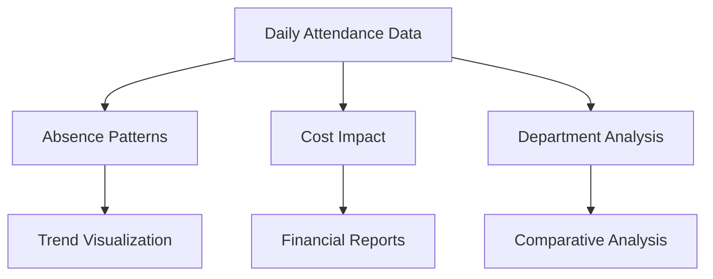
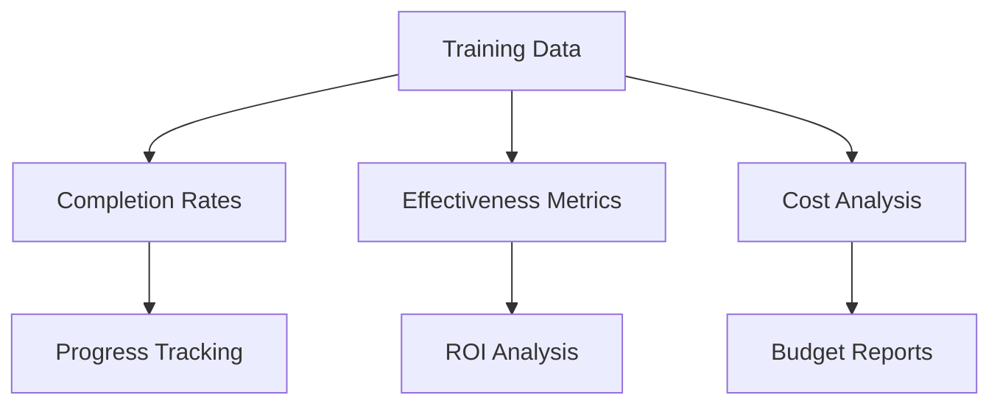
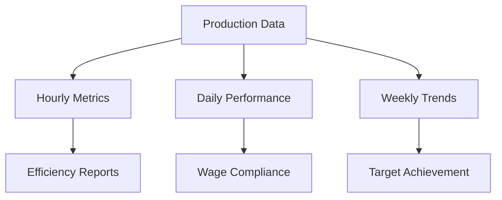
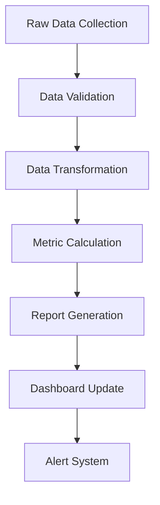

# Advanced HR Analytics & Reporting System

## 1. Attendance & Absenteeism Analytics

### 1.1 Core Metrics
```
ATTENDANCE TRACKING FORMULAS

Bradford Factor = S² × D
Where:
S = Number of spells of absence in 52 weeks
D = Total days of absence

Absence Rate = (Total Absence Hours ÷ Total Scheduled Hours) × 100

Frequency Rate = (Number of Absence Incidents ÷ Average Number of Employees) × 100

Lost Time Rate = (Total Hours Lost to Absence ÷ Total Hours Scheduled) × 100
```

### 1.2 Pattern Analysis
- Day-of-week trending
- Seasonal patterns
- Department comparisons
- Individual vs team patterns
- Correlation with events/workload

### 1.3 Cost Impact Analysis
```
Direct Cost Impact = Absent Hours × Hourly Rate
Indirect Cost Impact = (Replacement Cost + Productivity Loss + Administrative Cost)
Total Absence Cost = Direct Cost + Indirect Cost
Cost per Employee = Total Absence Cost ÷ Number of Employees
```

## 2. Training & Development Analytics

### 2.1 Training Effectiveness
```
Training ROI = [(Benefit from Training - Training Cost) ÷ Training Cost] × 100

Skill Improvement Rate = [(Post-Training Score - Pre-Training Score) ÷ Pre-Training Score] × 100

Knowledge Retention Rate = (Post-Training Test Score ÷ Initial Test Score) × 100
```

### 2.2 Training Coverage
```
Training Completion Rate = (Completed Training ÷ Assigned Training) × 100

Skill Gap Coverage = (Skills Acquired ÷ Required Skills) × 100

Training Hours per Employee = Total Training Hours ÷ Number of Employees
```

### 2.3 Cost Analysis
```
Training Cost per Employee = Total Training Cost ÷ Number of Employees

Cost per Training Hour = Total Training Cost ÷ Total Training Hours

Training Budget Utilization = (Actual Spend ÷ Budgeted Amount) × 100
```

## 3. Labor Productivity Analytics

### 3.1 Piece Rate Productivity
```
Hourly Production Rate = Units Produced ÷ Hours Worked

Efficiency Rate = (Actual Output ÷ Standard Output) × 100

Quality Rate = (Good Units ÷ Total Units Produced) × 100

First Pass Yield = (Units Passing First Inspection ÷ Total Units) × 100
```

### 3.2 Daily Minimum Wage Compliance
```
Daily Effective Rate = Daily Earnings ÷ Hours Worked

Wage Gap Analysis = Minimum Required Daily Rate - Actual Daily Rate

Compliance Rate = (Days Meeting Minimum Wage ÷ Total Working Days) × 100
```

### 3.3 Weekly Performance Metrics
```
Weekly Target Achievement = (Actual Output ÷ Weekly Target) × 100

Rolling Performance Index = Current Week Output ÷ 4-Week Average Output

Productivity Trend = (Current Week Rate - Previous Week Rate) ÷ Previous Week Rate
```

## 4. Visual Analytics Dashboards

### 4.1 Attendance Dashboard


### 4.2 Training Dashboard


### 4.3 Productivity Dashboard


## 5. Advanced Analytics Features

### 5.1 Predictive Analytics
```
Absence Prediction Model:
- Historical pattern analysis
- Weather impact correlation
- Event calendar correlation
- Workload impact analysis
- Seasonal trending

Productivity Forecast:
- Moving average trends
- Seasonal decomposition
- Growth rate analysis
- Capacity modeling
- Resource optimization
```

### 5.2 Machine Learning Models
```python
# Example ML Model Structure
model_features = [
    'historical_attendance',
    'workload_levels',
    'seasonal_factors',
    'team_composition',
    'training_completion',
    'experience_level'
]

target_variables = [
    'productivity_rate',
    'absence_probability',
    'performance_score'
]
```

## 6. Report Generation System

### 6.1 Daily Reports
```
DAILY METRICS TEMPLATE

Attendance:
- Present/Absent Count
- Late Arrivals
- Early Departures
- Unplanned Absences

Productivity:
- Units Produced
- Quality Metrics
- Efficiency Rates
- Target Achievement

Training:
- Sessions Completed
- Participants
- Hours Delivered
- Assessment Scores
```

### 6.2 Weekly Reports
```
WEEKLY ANALYSIS TEMPLATE

Performance Trends:
- Weekly Output
- Target Achievement
- Quality Metrics
- Efficiency Rates

Labor Metrics:
- Overtime Hours
- Productivity Rates
- Cost per Unit
- Wage Compliance

Training Progress:
- Completion Rates
- Skill Advancement
- Certification Status
- ROI Metrics
```

### 6.3 Monthly Reports
```
MONTHLY SUMMARY TEMPLATE

Operational Overview:
- Production Volume
- Quality Metrics
- Cost Analysis
- Efficiency Trends

Workforce Metrics:
- Attendance Patterns
- Training Coverage
- Skill Development
- Performance Trends

Financial Impact:
- Labor Costs
- Training ROI
- Productivity Value
- Cost Savings
```

## 7. Comparative Analytics

### 7.1 Internal Benchmarking
- Department vs Department
- Team vs Team
- Shift vs Shift
- Location vs Location
- Period vs Period

### 7.2 External Benchmarking
- Industry Standards
- Regional Averages
- Competitor Analysis
- Best Practice Metrics
- Global Standards

## 8. Integration & Data Flow

### 8.1 Data Sources
- Time & Attendance System
- Production Management System
- Quality Management System
- Training Management System
- Payroll System
- HR Information System

### 8.2 Data Processing


## 9. Custom Report Builder

### 9.1 Report Components
- Metric Selection
- Time Period Definition
- Comparison Parameters
- Visualization Options
- Export Formats
- Distribution Lists

### 9.2 Alert System
- Threshold Violations
- Trend Deviations
- Compliance Issues
- Performance Gaps
- Budget Variances
- Quality Concerns

## 10. Implementation Guidelines

### 10.1 Data Quality
- Validation Rules
- Cleaning Procedures
- Consistency Checks
- Accuracy Verification
- Completeness Monitoring

### 10.2 System Access
- Role-based Access
- Data Security
- Privacy Controls
- Audit Trails
- Version Control