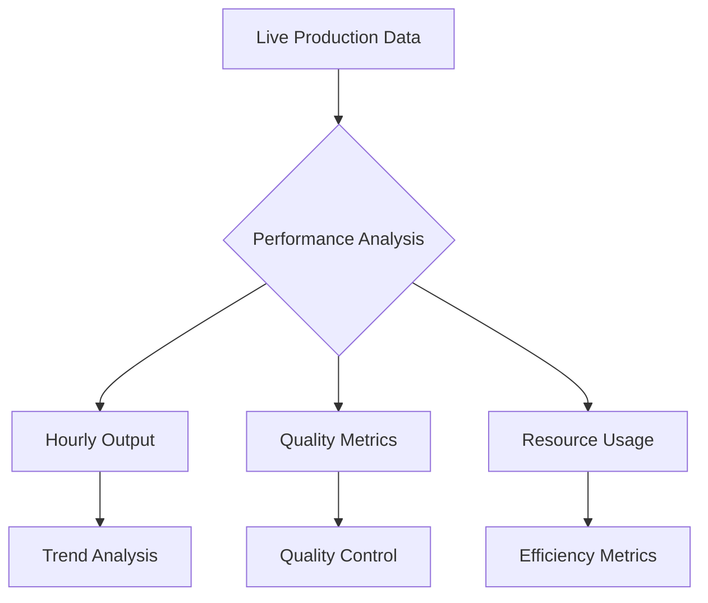

# Enhanced HR Analytics System

## 1. Advanced KPI Framework

### 1.1 Workforce Performance KPIs

#### Productivity Metrics
```
Individual Productivity Index (IPI) = 
(Units Produced × Quality Rate) ÷ (Standard Time × Hours Worked)

Team Velocity Index = 
(Team Output ÷ Team Size) ÷ (Department Average Output ÷ Average Team Size)

Quality-Adjusted Production Rate (QAPR) =
(Total Units - Defective Units) ÷ Total Production Hours

Cost Per Unit (CPU) = 
Total Production Cost ÷ Quality-Adjusted Output

Labor Utilization Rate =
Direct Labor Hours ÷ Total Available Hours
```

#### Efficiency Metrics
```
Overall Equipment Effectiveness (OEE) =
Availability × Performance × Quality

Process Efficiency Ratio =
Value-Added Time ÷ Total Production Time

Resource Utilization Index =
Actual Resource Usage ÷ Planned Resource Allocation

Downtime Impact Rate =
(Downtime Hours × Hourly Production Rate) ÷ Total Possible Output
```

### 1.2 Training & Development KPIs

#### Learning Effectiveness
```
Skill Application Rate =
(Tasks Completed Using New Skills ÷ Total Tasks) × 100

Certification Success Rate =
(Certifications Achieved ÷ Certifications Attempted) × 100

Performance Improvement Delta =
[(Post-Training Performance - Pre-Training Performance) ÷ Pre-Training Performance] × 100

Knowledge Transfer Index =
(Peer Training Sessions Conducted ÷ Training Sessions Attended) × 100
```

#### Training Investment
```
Training ROI = 
[(Performance Value Increase - Training Cost) ÷ Training Cost] × 100

Skill Gap Closure Rate =
(Skills Acquired ÷ Identified Skill Gaps) × 100

Learning Path Completion Rate =
(Completed Learning Milestones ÷ Total Planned Milestones) × 100
```

### 1.3 Attendance & Compliance KPIs

#### Time Management
```
On-Time Start Rate =
(On-Time Starts ÷ Total Shifts) × 100

Schedule Adherence =
(Actual Working Time ÷ Scheduled Working Time) × 100

Break Compliance Rate =
(Compliant Break Times ÷ Total Break Times) × 100
```

#### Overtime Analysis
```
Overtime Ratio =
Overtime Hours ÷ Regular Hours

Overtime Cost Impact =
(Overtime Hours × Overtime Rate) ÷ Total Labor Cost

Overtime Distribution Index =
Standard Deviation of Overtime Hours Across Teams
```

## 2. Enhanced Dashboard Visualizations

### 2.1 Real-Time Performance Monitor


### 2.2 Advanced Data Visualization Components
```javascript
// Visualization Types

1. Heat Map Calendar:
- Attendance patterns
- Productivity levels
- Training completion
- Overtime distribution

2. Radar Charts:
- Skill coverage
- Performance metrics
- Quality indicators
- Compliance scores

3. Bubble Charts:
- Cost vs. productivity
- Training impact
- Resource allocation
- Performance clusters

4. Waterfall Charts:
- Cost breakdown
- Production flow
- Time allocation
- Resource utilization
```

### 2.3 Interactive Analysis Tools

#### Performance Comparison Tool
```javascript
{
    components: [
        'Department Selector',
        'Time Period Slider',
        'Metric Selection Matrix',
        'Comparison Visualization',
        'Export Options'
    ],
    features: [
        'Real-time updates',
        'Drill-down capability',
        'Custom metric creation',
        'Trend identification',
        'Anomaly detection'
    ]
}
```

## 3. Detailed Report Templates

### 3.1 Daily Production Report
```
DAILY PRODUCTION SUMMARY
Date: [Auto-populated]
Shift: [Selection]

1. Production Metrics
   □ Total Output: _____
   □ Quality Rate: ____%
   □ Efficiency Rate: ____%
   □ Downtime: _____ minutes

2. Labor Metrics
   □ Total Hours Worked: _____
   □ Overtime Hours: _____
   □ Productive Hours: _____
   □ Labor Cost: $_____

3. Quality Metrics
   □ First Pass Yield: ____%
   □ Defect Rate: ____%
   □ Rework Hours: _____
   □ Quality Cost: $_____

4. Resource Utilization
   □ Equipment Usage: ____%
   □ Material Efficiency: ____%
   □ Energy Usage: _____
   □ Resource Cost: $_____

5. Exceptions & Issues
   □ Production Delays: _____
   □ Quality Issues: _____
   □ Resource Constraints: _____
   □ Safety Incidents: _____

6. Action Items
   □ Immediate Actions: _____
   □ Follow-up Required: _____
   □ Resources Needed: _____
```

### 3.2 Weekly Performance Analysis
```
WEEKLY PERFORMANCE REPORT
Week: [Auto-populated]
Department: [Selection]

1. Production Summary
   □ Weekly Target: _____
   □ Actual Output: _____
   □ Variance: ____%
   □ Trend Analysis: _____

2. Labor Analysis
   □ Attendance Rate: ____%
   □ Productivity Rate: ____%
   □ Overtime Analysis: _____
   □ Cost Performance: _____

3. Quality Overview
   □ Quality Metrics Trend
   □ Major Issues
   □ Improvements
   □ Cost Impact

4. Training & Development
   □ Sessions Completed
   □ Certifications Achieved
   □ Skill Gaps Identified
   □ Training Hours

5. Cost Analysis
   □ Labor Cost Variance
   □ Quality Cost Impact
   □ Resource Utilization
   □ Overall Efficiency

6. Action Plan
   □ Immediate Actions
   □ Preventive Measures
   □ Resource Requirements
   □ Timeline
```

### 3.3 Monthly Strategic Report
```
MONTHLY STRATEGIC ANALYSIS
Month: [Auto-populated]
Business Unit: [Selection]

1. Executive Summary
   □ Key Achievements
   □ Major Challenges
   □ Strategic Impact
   □ Future Outlook

2. Performance Analysis
   □ Productivity Trends
   □ Quality Metrics
   □ Cost Performance
   □ Resource Utilization

3. Workforce Insights
   □ Attendance Patterns
   □ Skill Development
   □ Performance Distribution
   □ Engagement Levels

4. Financial Impact
   □ Labor Cost Analysis
   □ Training ROI
   □ Quality Cost Impact
   □ Efficiency Savings

5. Strategic Initiatives
   □ Current Progress
   □ Risk Assessment
   □ Resource Allocation
   □ Timeline Updates

6. Recommendations
   □ Process Improvements
   □ Resource Optimization
   □ Training Needs
   □ Strategic Adjustments
```

## 4. Implementation Guidelines

### 4.1 Data Collection Standards
- Real-time data capture
- Validation protocols
- Quality checks
- Integration requirements

### 4.2 Reporting Schedule
- Daily reports by shift end
- Weekly reports by Monday noon
- Monthly reports by 5th of month
- Quarterly analysis by month end

### 4.3 Access Control Matrix
- Executive level: Full access
- Manager level: Department specific
- Supervisor level: Team specific
- Operator level: Individual metrics